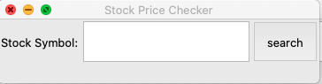
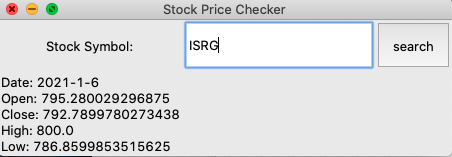
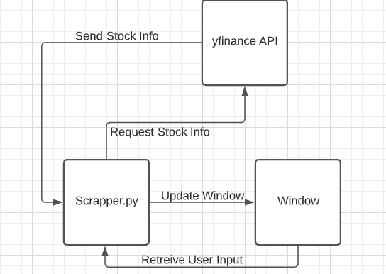

# Stock Price Checker
&nbsp; &nbsp; &nbsp;    &nbsp;Stock price checker will scrap stock price data from a public website so that when given a stock tick symbol (e.g. “ISRG”, aka Intuitive Surgical) as the input, the application returns the stock’s high, low, open and close prices today. **If the market is not yet open, it will return yesterday's data.**

 

## Getting Started
go to the residing folder and run:  
    % python scrappper.py  

### Prerequisites

Python 3.*  
yfinance  
tkinter  

you can install yfinance with terminal:

pip install yfinance

      
    
### Exmaple(if run correctly)

## Architecture Diagram

## Authors

* **Yifei Liang** - scrapper.py

